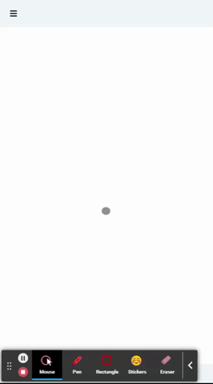

# Swipe Library

The Library provides handlers for touchstart, touchend, and touchmove event listeners that apply to DOM elements.

Create Sidebars, Dropdowns, and any kind of UI element that is controlled by a touch event.

## Simple usage example

```javascript

import {SwipeElement, SwipeService} from '@argab/swipe'

const el = document.getElementById('#swipe')

const swipe = new SwipeService(el, {
    direction: 'left', // up|down|left|right
    onStart: () => {
    }, // do smth on touchsart
    onEnd: () => {
    }, // do smth on touchend
    onMove: () => {
    }, // do smth on touchmove
    fixed: true, // the swipe element will be returned 
                 // to it`s stating position on touchend
    fixedTimeout: 200,
})

const swipeEl = new SwipeElement(el, swipe)

swipe.validate() && swipeEl.addListeners()

```

####Note that in order to make an element movable on touch,
####You must apply absolute positioning or fixed CSS styling to it.

## Integration with Vue.js

```javascript

import {VueSwipeDirective} from '@argab/swipe'

const app = createApp({})

app.directive('swipe', VueSwipeDirective)

```

Now you can apply a simple swipe elements on Vue Templates:





```vue

<template>
    <transition name="ui-sidebar-transition">
        <div
            v-show="show"
            class="ui-sidebar"
            :class="swipe && 'ui-sidebar-swipe'"
            v-swipe.left.fixed:200="swipe && {
                onEnd: ({threshold}) => {
                    if (threshold <= 50) {
                        $listener.setup('sidebar', {showSwiped: false})
                        return show = false
                    }
                },
            }"
        >
            <h1>Simple Swipe</h1>
            <slot/>
        </div>
    </transition>
</template>

<script>
export default {
    props: {
        swipe: Boolean
    },
    data: () => ({
        show: true,
    }),
    mounted () {
        this.swipe && this.$listener.on('sidebar', {
            state: {
                showSwiped: (show) => this.show = Boolean(show)
            }
        })
        this.swipe && this.$listener.setup('sidebar', {
            swipe: true,
            showSwiped: false,
        })
    },
    beforeDestroy () {
        this.$listener.reset('sidebar')
    }
}
</script>

<style lang="scss">
.ui-sidebar {
    height: 100vh;
    width: 100%;
    background-color: #2E3440;
    color: #fff;
    padding: 20px;

    &-swipe {
        position: fixed;
        top: 0;
        left: 0
    }
}

.ui-sidebar-transition-enter-active,
.ui-sidebar-transition-leave-enter {
    transform: translateX(0);
    transition: all .2s linear;
}

.ui-sidebar-transition-enter,
.ui-sidebar-transition-leave-to {
    transform: translateX(-100%);
}
</style>
```

## API

### SwipeService's properties

| Name           | Data Type | Arguments                         | Return               | Default | Description                                                                             |
|----------------|-----------|-----------------------------------|----------------------|---------|-----------------------------------------------------------------------------------------|
| `direction`    | String    | up&#124;down&#124;left&#124;right |                      |         | Target Element's moving direction                                                       |
| `fixed`        | Boolean   | true&#124;false                   |                      | false   | Target Element will be returned to it's stating position on touchend                    |
| `fixedTimeout` | Number    | milliseconds                      |                      | 0       | Timeout before Target Element returned to it's stating position                         |
| `onStart`      | Function  | Object                            | undefined            |         | On touchstart event handler                                                             |
| `onEnd`        | Function  | Object                            | undefined            |         | On touchend event handler                                                               |
| `onMove`       | Function  | Object                            | false&#124;undefined |         | On touchmove event handler. `Returning FALSE forces embedded handler to stop execution` |

### Event Handler's (onStart, onEnd, onMove) arguments

| Argument       | Data Type | Example                                           | Description                                                                                                      |
|----------------|-----------|---------------------------------------------------|------------------------------------------------------------------------------------------------------------------|
| `x`            | Number    |                                                   | Target Event's absolute coordinate                                                                               |
| `y`            | Number    |                                                   | Target Event's absolute coordinate                                                                               |
| `period`       | Number    |                                                   | The period in milliseconds that left from touchstart event                                                       |
| `dir`          | Object    | {up: true, down: false, left: true, right: false} | Target Element's direction data                                                                                  |
| `event`        | Object    |                                                   | Target Event's data                                                                                              |
| `startX`       | Number    |                                                   | Target Event's starting position's absolute coordinate                                                           |
| `startY`       | Number    |                                                   | Target Event's starting position's absolute coordinate                                                           |
| `diff`         | Object    | {x: 0, y: 0}                                      | Difference between Target Event's absolute coordinate and Target Event's starting position's absolute coordinate |
| `threshold`    | Number    | 0-100%                                            | The offset in percentage from the initial position of the Target Element                                         |


##Try out another powerful package from the author:

**[Request Service](https://www.npmjs.com/package/@argab/request-service)** - This Library can totally organize working with REST API in your whole project.

**<font color=orange>Please, don't forget to paste </font> into author's [github repository](https://github.com/argab)**

**this support will inspire to create more powerful things for You.**


